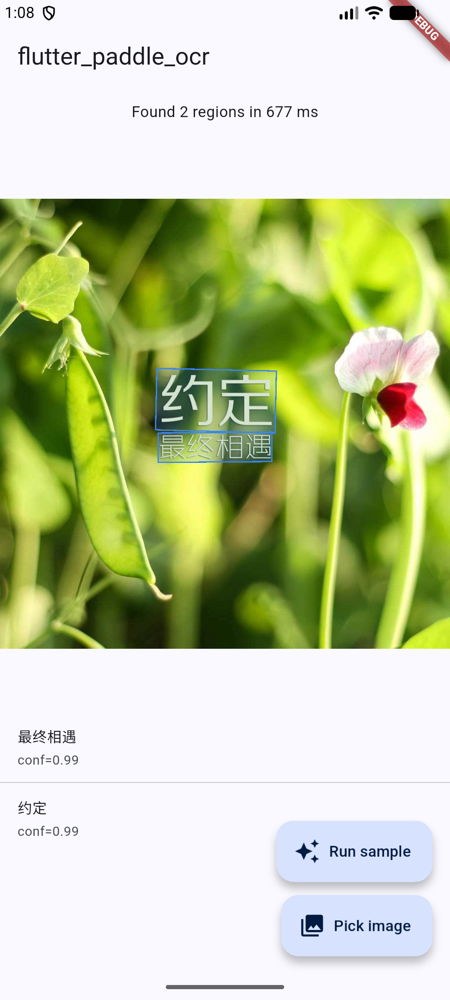
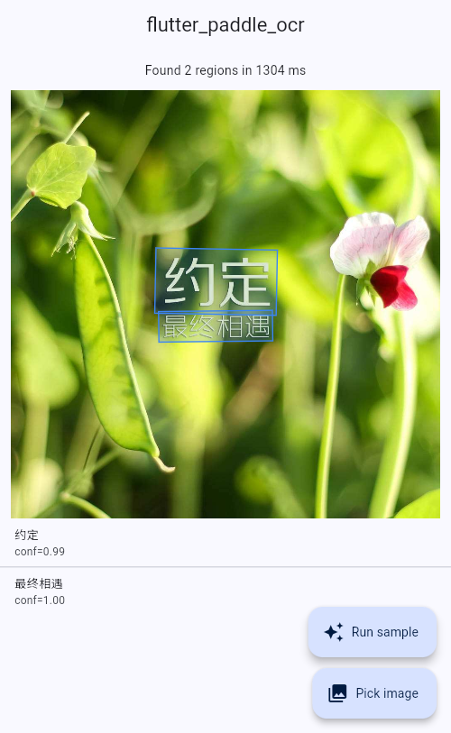

# flutter_paddle_ocr

On-device OCR for Flutter. One Dart API, three backends:

- **Android** wraps PaddleOCR's [`deploy/android_demo/`](https://github.com/PaddlePaddle/PaddleOCR/tree/main/deploy/android_demo) C++/JNI pipeline over Paddle Lite v2.10
- **iOS** wraps Paddle-Lite-Demo's [`ocr/ios/ppocr_demo/`](https://github.com/PaddlePaddle/Paddle-Lite-Demo/tree/develop/ocr/ios/ppocr_demo) Obj-C++ pipeline over the same Paddle Lite runtime
- **Web** binds [`@paddleocr/paddleocr-js`](https://www.npmjs.com/package/@paddleocr/paddleocr-js) (ONNX Runtime Web + OpenCV.js) through `dart:js_interop`

<p align="center">
  
  &nbsp;
  
</p>

<sub>Left: Android emulator, PP-OCRv2 via Paddle Lite. Right: Chrome, PP-OCRv5 via paddleocr-js. iOS device screenshot pending — Paddle Lite v2.10 ships an arm64-device-only `.a` so it can't run in the simulator.</sub>

---

## Compatibility matrix

| Platform | Backend | Models |
| --- | --- | --- |
| Android arm64-v8a (min SDK 24) | Paddle Lite v2.10 (`.nb`) | PP-OCRv2 / v3 slim via `ModelSource.filePaths` |
| iOS 13+ arm64 device | Paddle Lite v2.10 (`.a`) | PP-OCRv2 / v3 slim via `ModelSource.filePaths` |
| Web (Chrome, Safari, Firefox) | paddleocr-js + ONNX Runtime Web | PP-OCRv5 via `ModelSource.bundled` (fetched from CDN) |

Known gaps:
- **Android armeabi-v7a** — Paddle Lite v2.10's prebuilt archive doesn't ship 32-bit libs. Google Play has required 64-bit since 2019 so this covers almost every supported device.
- **iOS simulator** — Paddle Lite v2.10 publishes an arm64-device-only `.a`. Test on a physical device.
- **PP-OCRv5 on mobile** — upstream hasn't published mobile-optimized `.nb` files yet. Web gets v5 because paddleocr-js runs the full ONNX models.

## Installation

```sh
flutter pub add flutter_paddle_ocr
```

Or pin a version in `pubspec.yaml`:

```yaml
dependencies:
  flutter_paddle_ocr: ^0.0.2
```

### Android setup

Paddle Lite v2.10 predates NDK r27's stricter linker, so the plugin pins **NDK r25c** (`25.2.9519653`):

```
sdkmanager --install "ndk;25.2.9519653"
```

On first build `android/build.gradle` downloads:
- `paddle_lite_libs_v2_10.tar.gz` (~75 MB) — native `libpaddle_light_api_shared.so`
- `opencv-4.2.0-android-sdk.tar.gz` (~150 MB) — OpenCV static libs

Cached in `android/cache/` by MD5, so repeat builds are offline.

### iOS setup

On `pod install`, the plugin's `prepare_command` downloads:
- `paddle_lite_libs_v2_10_rc.tar.gz` (~15 MB) — `libpaddle_api_light_bundled.a`
- `opencv-4.5.5-ios-framework.tar.gz` (~215 MB) — `opencv2.framework`

The example app also needs photo-library permission — add to `ios/Runner/Info.plist`:

```xml
<key>NSPhotoLibraryUsageDescription</key>
<string>OCR on images from your photo library.</string>
```

### Web setup

paddleocr-js is ESM-only with Node-ish transitive deps that don't load cleanly from a CDN. The example ships `prepare_web.sh` which bundles everything into one `web/paddleocr_bundle.js` via esbuild:

```
./example/prepare_web.sh       # requires Node.js
```

Then reference the bundle in `web/index.html`:

```html
<script src="paddleocr_bundle.js"></script>
```

Downstream apps can copy the same script into their own `web/` directory. The bundle is ~11 MB; ONNX Runtime's WASM is fetched separately from the CDN the plugin points `ortOptions.wasmPaths` at.

## Usage

```dart
import 'dart:typed_data';
import 'package:flutter/foundation.dart' show kIsWeb;
import 'package:flutter_paddle_ocr/flutter_paddle_ocr.dart';

final source = kIsWeb
    ? const ModelSource.bundled(lang: 'ch', version: 'PP-OCRv5')
    : ModelSource.filePaths(
        det:  '/path/to/det_db.nb',
        rec:  '/path/to/rec_crnn.nb',
        dict: '/path/to/ppocr_keys_v1.txt',
        cls:  '/path/to/cls.nb',  // optional — enables angle classification
      );

final ocr = await PaddleOcr.create(source: source);

final Uint8List bytes = ...;  // PNG/JPEG/WebP
final results = await ocr.recognize(bytes, runClassification: !kIsWeb);
for (final r in results) {
  print('${r.text}  (${r.confidence.toStringAsFixed(2)})  ${r.points}');
}

await ocr.dispose();
```

### Getting mobile models

From PaddleOCR's own demo:
- **PP-OCRv2 bundle** — https://paddleocr.bj.bcebos.com/PP-OCRv2/lite/ch_PP-OCRv2.tar.gz (`det_db.nb`, `rec_crnn.nb`, `cls.nb`)
- **Chinese dictionary** — https://paddleocr.bj.bcebos.com/dygraph_v2.0/lite/ch_dict.tar.gz (`ppocr_keys_v1.txt`)

For other languages see [PaddleOCR's model list](https://github.com/PaddlePaddle/PaddleOCR/blob/main/doc/doc_en/models_list_en.md) and pair the matching dictionary from [`ppocr/utils/`](https://github.com/PaddlePaddle/PaddleOCR/tree/main/ppocr/utils).

The example app downloads and extracts these tarballs at first launch: [`example/lib/mobile_bootstrap.dart`](example/lib/mobile_bootstrap.dart).

## Example

```
cd example
./prepare_web.sh          # only needed for `flutter run -d chrome`
flutter run
```

The demo ships a bundled sample image so OCR is verifiable without picking from the gallery. On mobile the first launch downloads ~5 MB of `.nb` models; on web paddleocr-js pulls ~13 MB of `.onnx` from the Baidu CDN.

## How it works

```
 Dart (PaddleOcr.recognize)
   ↓ FlutterPaddleOcrPlatform.instance
   ├─ MethodChannelFlutterPaddleOcr            (Android, iOS)
   │    ↓ MethodChannel
   │    ├─ Kotlin  → JNI → C++ → Paddle Lite .nb    (Android)
   │    └─ Swift   → Obj-C++ → Paddle Lite .nb      (iOS)
   └─ FlutterPaddleOcrWeb                       (Web)
        ↓ dart:js_interop
        window.PaddleOCR → ONNX Runtime Web + OpenCV.js
```

Native sources are copied verbatim from upstream:
- Android `android/src/main/cpp/` + `android/src/main/java/com/baidu/...` from [PaddleOCR/deploy/android_demo/](https://github.com/PaddlePaddle/PaddleOCR/tree/main/deploy/android_demo)
- iOS `ios/Classes/ppocr/` from [Paddle-Lite-Demo/ocr/ios/ppocr_demo/](https://github.com/PaddlePaddle/Paddle-Lite-Demo/tree/develop/ocr/ios/ppocr_demo) (one NEON guard added to `utils.cpp` so non-ARM simulator builds link; see the file comment)

The plugin adds a MethodChannel handler + a label-dictionary post-process on mobile, and a `dart:js_interop` binding on web — no changes to upstream algorithms.

## Upgrading Paddle Lite

Most users won't need to. If you do:

1. Set `paddleLiteVersion` in your app's `android/gradle.properties` (or pass `-PpaddleLiteVersion=v2_12`).
2. Edit `PADDLE_LITE_VERSION` in `ios/flutter_paddle_ocr.podspec`'s `prepare_command`, or point it at a different tarball.
3. Delete the cached archives (`<plugin>/android/PaddleLite/`, `<plugin>/android/cache/`, `<plugin>/ios/Frameworks/`) to force a re-download.
4. Rebuild. If the C++ wrappers no longer compile, patch `ppredictor.cpp` / `predictor_input.cpp` / `predictor_output.cpp` — they're thin wrappers around `paddle::lite_api::MobileConfig` and the delta between versions is usually a handful of lines.
5. Re-optimize `.nb` models with the new `opt` tool if the naive-buffer format changed.

## Roadmap

- **v0.3** — switch the native backends from Paddle Lite to ONNX Runtime Mobile so PP-OCRv5 works on Android/iOS and the iOS simulator gap goes away. See [`doc/migration-v0.3-onnx.md`](doc/migration-v0.3-onnx.md).

## License

Apache License 2.0 — same as the reused upstream PaddleOCR and Paddle-Lite-Demo sources.
